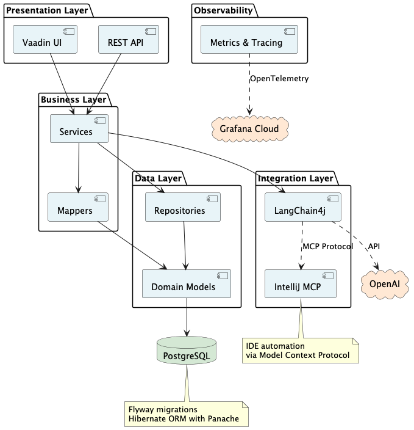

# Game Manager

People will register for the game at the booth and play it. The game management system will keep track of who has played, scores, etc. We can even run the leaderboard on the main monitor in the booth and it'll refresh automatically as people play.

The game starts with a Quarkus + LangChain4j app, running in the IDE with dev mode + continuous testing running. The tests are failing. The objective is to get the tests to go green as fast as possible.

The completed game can be found at https://github.com/edeandrea/booth-game.

> [!NOTE]
> It's not too difficult & shouldn't take someone more than 5-10 minutes

The whole game infrastructure will run on the following Raspberry Pi setup (showing how efficient Quarkus is that the whole system can run on it, + a user interface, IntelliJ IDE, etc)
- [Raspberry Pi 500 Desktop Kit](https://www.raspberrypi.com/products/500-desktop-kit/)
- [Raspberry Pi 500](https://www.raspberrypi.com/products/raspberry-pi-500/)
- [Raspberry Pi Monitor](https://www.raspberrypi.com/products/raspberry-pi-monitor/)

The game manager itself (this application) is a nice showcase of Quarkus + LangChain4j, how to be an MCP client, etc.

The entire system is also monitored real-time in [Grafana Cloud](https://grafana.com/products/cloud).

## Technology Stack

### Backend Framework(s)
- [Quarkus](https://quarkus.io/)
- [Java 25](https://www.oracle.com/java/)
- [Maven](https://maven.apache.org/)

### Database & Persistence
- [PostgreSQL](https://www.postgresql.org/)
- [Hibernate ORM with Panache](https://quarkus.io/guides/hibernate-orm-panache)
- [Flyway](https://quarkus.io/guides/flyway)
- [Compose Dev Service](https://quarkus.io/guides/compose-dev-services)

### Frontend
- [Vaadin Flow](https://quarkus.io/extensions/com.vaadin/vaadin-quarkus-extension/)
- [Line Awesome](https://icons8.com/line-awesome)

### AI & Integration
- [LangChain4j](https://docs.langchain4j.dev/)
  - [OpenAI](https://openai.com/) - Uses `gpt-5-mini` model
  - [Model Context Protocol (MCP)](https://modelcontextprotocol.io/)
- [IntelliJ MCP Server](https://www.jetbrains.com/help/idea/mcp-server.html)

### Observability
- [OpenTelemetry](https://quarkus.io/guides/opentelemetry)
- [Micrometer](https://quarkus.io/guides/telemetry-micrometer)
- [JDBC instrumentation](https://quarkus.io/guides/datasource#datasource-tracing)

### Additional Tools
- [MapStruct](https://mapstruct.org/)
- [JGit](https://docs.quarkiverse.io/quarkus-jgit/dev/index.html)
- [Hibernate Validator](https://quarkus.io/guides/validation)

### Testing
- [JUnit](https://junit.org/)
- [Mockito](https://site.mockito.org/)
- [REST Assured](https://rest-assured.io/)
- [AssertJ](https://assertj.github.io/doc/)
- [DataFaker](https://www.datafaker.net/)

## Architecture

The application follows a layered architecture with clear separation of concerns:

- **Presentation Layer** - Vaadin-based web UI with views and components
- **REST API Layer** - RESTful endpoints for external access
- **Service Layer** - Business logic and orchestration
- **Repository Layer** - Data access with Panache repositories
- **Domain Layer** - Entity models and data transfer objects
- **Mapping Layer** - MapStruct mappers for DTO conversions
- **Integration Layer** - External integrations (IntelliJ MCP, OpenAI)
- **Cross-cutting Concerns** - Observability, broadcasting

See [architecture.puml](images/architecture.puml) for a detailed component diagram.



### Key Components

- **Event Management** - Create and manage game events
- **Game Management** - Track games associated with events
- **IDE Integration** - IntelliJ IDEA integration via MCP
- **DevUI** - Development interface services
- **Observability** - Telemetry and monitoring

## Building and Running

### Development Mode
```bash
./mvnw quarkus:dev
```

### Production Build

### Prerequisites

Start the PostgreSQL database using Docker Compose (or podman compose):
```bash
docker compose -f compose-devservices.yml up -d
```

This will start a PostgreSQL 18 container with data persisted to `~/.games`.

```bash
./mvnw clean package
```

### Native Build
```bash
./mvnw package -Pnative
```
